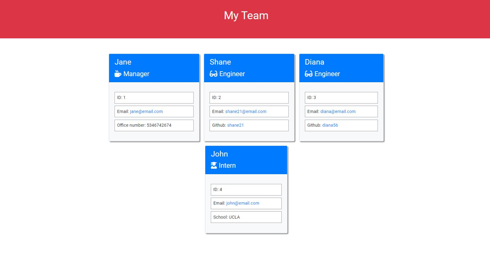

# Team Profile Generator

## Description

In this project a Node.js command-line application was build to take in information about employees on a software engineering team and as a result generates an HTML webpage that displays the summaries for each employee. Unit testing was applied for each part of the code to ensure it passes all tests

## Installation

The application uses jest for running test and Inquirer for collecting input from the user. The application will be invoked by using the following command:

```
node index.js
```

## Usage

[Demonstration Video](https://watch.screencastify.com/v/9faYYWAUoPNRDZQOIRcG)


